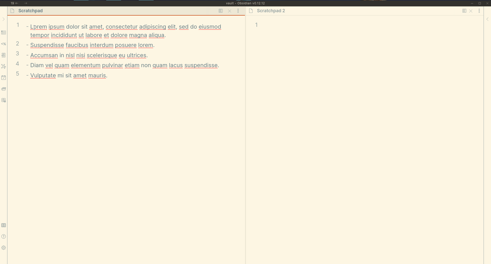
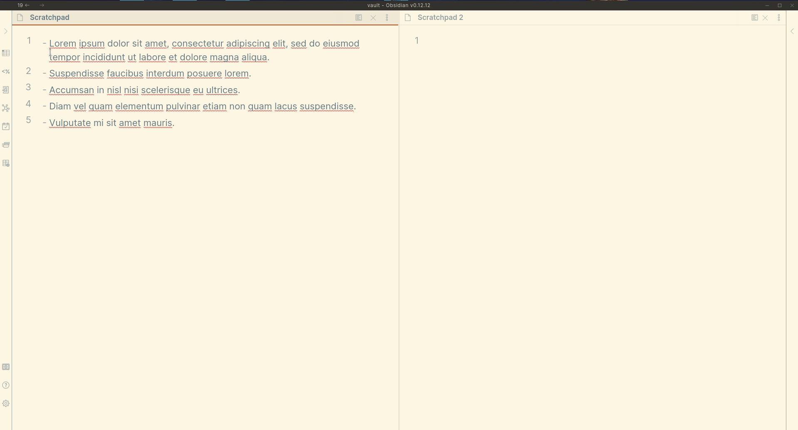

<h1 align="center">Obsidian Carry-Forward plugin</h1>

Copy text from a note, linking back to its copied source, or copy a link to a note block.

This plugin facilitates [linking to blocks](https://help.obsidian.md/How+to/Link+to+blocks) (e.g., specific lines) within an [Obsidian](https://obsidian.md/) note. It allows:

- Copying a link to the current line, and
- Copying text from one note with automatically-added links back to the where the text was copied from. This can be useful, for example, when using note-taking methods like [Bullet Journaling](https://bulletjournal.com/blogs/bulletjournalist/migration), which involve periodically moving tasks forward from past days' notes into the current day's note.

> Please submit bugs here: https://github.com/publicus/obsidian-carry-forward
>
> Please submit ideas here: https://github.com/publicus/obsidian-carry-forward/discussions/categories/ideas
>
> Please ask for help here: https://github.com/publicus/obsidian-carry-forward/discussions/categories/q-a

---

<ul>
    <li><a href="#installation">Installation</a></li>
    <li><a href="#usage">Usage</a></li>
</ul>

For changes in each release, please check the releases page: https://github.com/publicus/obsidian-carry-forward/releases

---

## Screenshots and Usage

The plugin provides four primary commands:

1. `Carry Forward: Copy selection with each line linked to its copied source`  
  

2. `Carry Forward: Copy selection with first line linked to its copied source`  
  

3. `Carry Forward: Copy link to line`  
   

4. `Carry Forward: Copy embed link to line`  
   

- Within the Settings tab, a [Regular Expression](https://www.regular-expressions.info) can be set for precisely placing links in the copied text -- whether at the beginning of a line, end of a line, or replacing existing text.
  - This plugin uses the [ECMAScript / Javascript flavor](https://www.regular-expressions.info/javascript.html) of Regular Expressions.
- *The theme in the screenshots above is [Solarized Light](https://github.com/Slowbad/obsidian-solarized).*

Variants of the above commands allow setting the copied link's text using the **current selection** or the **current clipboard text.**

## Installation

Follow the steps below to install the plugin.

1. Search for "Carry Forward" in Obsidian's community plugins browser
2. Enable the plugin in your Obsidian settings (find "Carry Forward" under "Community plugins").
3. Check the "Carry Forward" settings tab.
4. (Optional) In the "Hotkeys" settings tab, add a hotkey for one or both of the "Carry Forward..." commands.

## Development
Clone the repository, run `yarn` to install the dependencies, and run `yarn dev` to compile the plugin and watch file changes.

## License

This plugin's documentation setup is based off of the [Obsidian Tasks](https://github.com/schemar/obsidian-tasks) plugin by [Martin Schenck](https://github.com/schemar). Like that plugin, this plugin is released under the [MIT license](./LICENSE).

# Todo

Automated tests are not currently included in this code for this repository. Assistance in this, particularly using the [Obsidian End-to-End testing approach](https://github.com/trashhalo/obsidian-plugin-e2e-test), is especially welcome!
